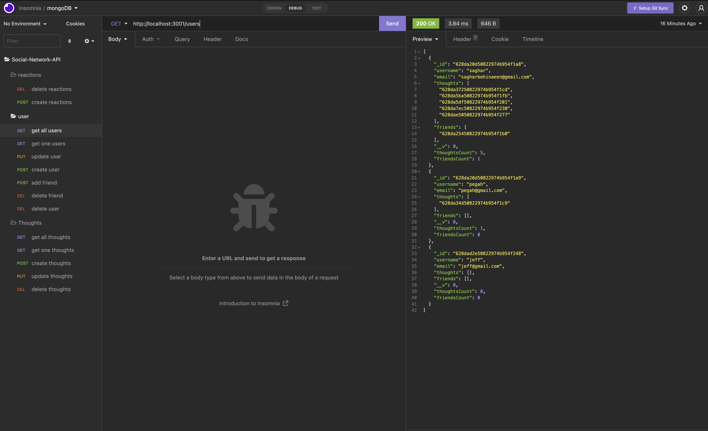

# 18 NoSQL: Social Network API
### Saghar Behinaein


## User Story

```md
AS A social media startup
I WANT an API for my social network that uses a NoSQL database
SO THAT my website can handle large amounts of unstructured data
```
## Installation
Here are some guidelines to help you get started:

1. Clone the project in your laptop  
2. make sure you installed Node on your visual studio 
3.  Run the `npm i` comand in your terminal 
4.  run the `node server.js`in terminal
11. start insomnia GET `localhost:3001/api/users` and keep continue for the rest 

## My work


the social network API
*  enter the command to invoke the application
* server is started and the Mongoose models are synced to the MongoDB database
* API GET routes in Insomnia for users and thoughts
* data for each of these routes is displayed in a formatted JSON
* test API POST, PUT, and DELETE routes in Insomnia
* successfully create, update, and delete users and thoughts in my database
* test API POST and DELETE routes in Insomnia
* able to successfully create and delete reactions to thoughts and add and remove friends to a user’s friend list
  
## Demo link
you can see demo link bellow:  
[Demo link](https://www.youtube.com/watch?v=3tL9cAgCwao&ab_channel=sagharbehinaeen)

## test



